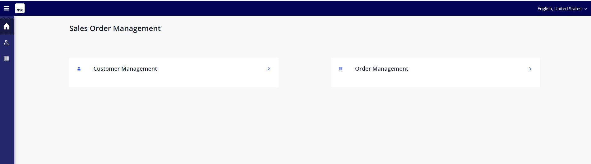

# Mendix Sales Order Management App (Hands On Lab) 

## User story

There is a requirement to manage customer master data with their order inforamtion. One customer makes multiple order with an order price. A sales team wants to view total amount of order on customer information.
* Customer mater data management
* A customer usually has multple orders.
* A total order amount of each customer will be calculated when a new order comes in.

## Preparation
1. Mendix user account: Register if you have no Mendix account [Sign up for Mendix user account](https://signup.mendix.com/)
1. Laptop for hands-on lap: Windows 10/11 PC (or Mac) + Mendix Studio Pro 10.x
    * [Installing Mendix Studio Pro](https://docs.mendix.com/refguide/install/)

## [Lab 1 Creat entities and attributes in Domain Model(5 minutes)](lab01-01-DomainModel.md)

## [Lab 2 Develop Web pages (5 minutes)](lab01-02-DomainModel.md)

## [Lab 3 Develop Microflow (5 minutes)](lab01-03-DomainModel.md)
